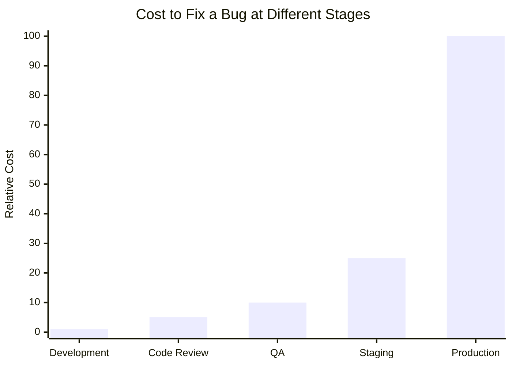
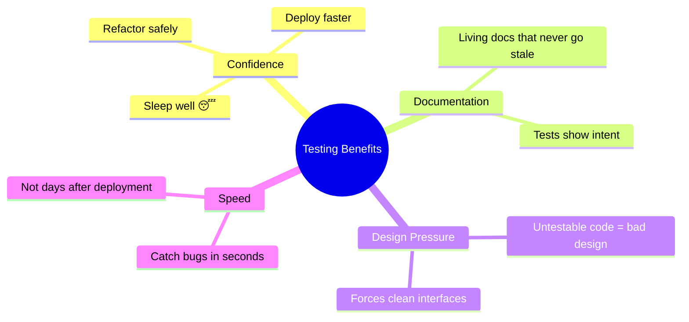

# 01 — Why Testing Matters

> 🟢 **Beginner**

[← Back to Index](../README.md)

---

Testing is not about finding bugs — it's about **preventing them from reaching users** and **giving developers confidence to change code**.

## The Cost of a Bug Over Time

A bug that costs **$1** to fix during development costs **$100** in production. This is why automated testing exists.

## What Good Tests Give You

## Key Takeaways

| Without Tests | With Tests |
|--------------|------------|
| Fear of refactoring | Refactor with confidence |
| Manual regression testing | Automated regression in seconds |
| Bugs reach production | Bugs caught before merge |
| Slow, careful deployments | Fast, frequent deployments |
| Tribal knowledge | Living, executable documentation |

---

**Next →** [The Testing Pyramid](./02-testing-pyramid.md)
