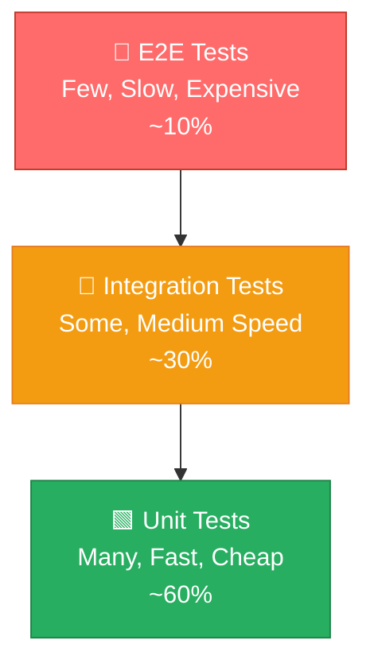
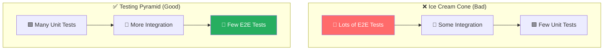

# 02 — The Testing Pyramid

> 🟢 **Beginner**

[← Back to Index](../README.md)

---

The testing pyramid describes the **ideal ratio** of test types in a healthy codebase.

## The Pyramid

| Layer | Count | Speed | Purpose |
|-------|-------|-------|---------|
| **Unit** | Hundreds–thousands | Milliseconds | Logic correctness |
| **Integration** | Dozens–hundreds | Seconds | Components work together |
| **E2E** | A handful | Minutes | Critical user flows work |

## The Anti-Pattern: Ice Cream Cone

> **Anti-pattern**: The Ice Cream Cone — lots of slow E2E tests, few fast unit tests. This makes CI take 40+ minutes and gives developers no fast feedback loop.

## Practical Target Ratios

| Project Size | Unit | Integration | E2E |
|-------------|------|-------------|-----|
| Small / startup | 70% | 20% | 10% |
| Medium / growing | 60% | 30% | 10% |
| Large / enterprise | 55% | 35% | 10% |

The exact numbers matter less than the **direction**: prioritise fast tests, keep E2E lean and focused on critical user journeys only.

---

**← Previous:** [Why Testing Matters](./01-why-testing-matters.md) · **Next →** [Unit Testing](./03-unit-testing.md)
