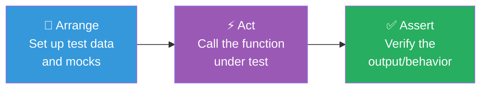

# 03 — Unit Testing

> 🟢 **Beginner** — Start here

[← Back to Index](../README.md)

---

A unit test tests **one function or class in isolation**, with all external dependencies replaced by mocks or stubs.

## The AAA Pattern

Every unit test follows three steps:

```
Arrange → Act → Assert
```



---

## 3.1 Frontend Unit Test — Pure Function

**Use case**: A pricing utility used across an e-commerce site.

```javascript
// utils/pricing.js
export function applyDiscount(price, discountPercent) {
  if (discountPercent < 0 || discountPercent > 100) {
    throw new Error('Discount must be between 0 and 100');
  }
  return price - (price * discountPercent) / 100;
}

export function formatPrice(amount, currency = 'USD') {
  return new Intl.NumberFormat('en-US', {
    style: 'currency',
    currency,
  }).format(amount);
}
```

```javascript
// utils/pricing.test.js  (using Vitest or Jest)
import { describe, it, expect } from 'vitest';
import { applyDiscount, formatPrice } from './pricing';

describe('applyDiscount', () => {
  it('applies a 10% discount correctly', () => {
    // Arrange
    const price = 100;
    const discount = 10;

    // Act
    const result = applyDiscount(price, discount);

    // Assert
    expect(result).toBe(90);
  });

  it('applies 0% discount and returns original price', () => {
    expect(applyDiscount(50, 0)).toBe(50);
  });

  it('applies 100% discount and returns 0', () => {
    expect(applyDiscount(200, 100)).toBe(0);
  });

  it('throws when discount is negative', () => {
    expect(() => applyDiscount(100, -5)).toThrow('Discount must be between 0 and 100');
  });

  it('throws when discount exceeds 100', () => {
    expect(() => applyDiscount(100, 110)).toThrow('Discount must be between 0 and 100');
  });
});

describe('formatPrice', () => {
  it('formats USD by default', () => {
    expect(formatPrice(1234.5)).toBe('$1,234.50');
  });

  it('formats EUR currency', () => {
    expect(formatPrice(99.99, 'EUR')).toContain('99.99');
  });
});
```

---

## 3.2 API Unit Test — Service Layer

**Use case**: A Node.js user service with a database dependency.

```javascript
// services/userService.js
export class UserService {
  constructor(db) {
    this.db = db;
  }

  async getUserById(id) {
    if (!id || typeof id !== 'string') {
      throw new Error('Invalid user ID');
    }
    const user = await this.db.findOne({ id });
    if (!user) throw new Error(`User ${id} not found`);
    return user;
  }

  async createUser(data) {
    const { email, name } = data;
    if (!email || !name) {
      throw new Error('email and name are required');
    }
    const existing = await this.db.findOne({ email });
    if (existing) throw new Error('Email already in use');
    return this.db.insert({ email, name, createdAt: new Date() });
  }
}
```

```javascript
// services/userService.test.js
import { describe, it, expect, vi, beforeEach } from 'vitest';
import { UserService } from './userService';

describe('UserService', () => {
  let db;
  let service;

  beforeEach(() => {
    // Arrange: create a fresh mock db before each test
    db = {
      findOne: vi.fn(),
      insert: vi.fn(),
    };
    service = new UserService(db);
  });

  describe('getUserById', () => {
    it('returns a user when found', async () => {
      const mockUser = { id: 'u1', name: 'Alice', email: 'alice@example.com' };
      db.findOne.mockResolvedValue(mockUser);

      const result = await service.getUserById('u1');

      expect(db.findOne).toHaveBeenCalledWith({ id: 'u1' });
      expect(result).toEqual(mockUser);
    });

    it('throws when user is not found', async () => {
      db.findOne.mockResolvedValue(null);

      await expect(service.getUserById('missing')).rejects.toThrow('User missing not found');
    });

    it('throws for invalid id types', async () => {
      await expect(service.getUserById(null)).rejects.toThrow('Invalid user ID');
      await expect(service.getUserById(123)).rejects.toThrow('Invalid user ID');
    });
  });

  describe('createUser', () => {
    it('creates a user with valid data', async () => {
      db.findOne.mockResolvedValue(null);
      db.insert.mockResolvedValue({ id: 'u2', email: 'bob@example.com', name: 'Bob' });

      const result = await service.createUser({ email: 'bob@example.com', name: 'Bob' });

      expect(db.insert).toHaveBeenCalled();
      expect(result.email).toBe('bob@example.com');
    });

    it('throws when email is already in use', async () => {
      db.findOne.mockResolvedValue({ email: 'taken@example.com' });

      await expect(
        service.createUser({ email: 'taken@example.com', name: 'Carol' })
      ).rejects.toThrow('Email already in use');
    });

    it('throws when required fields are missing', async () => {
      await expect(service.createUser({ name: 'No Email' })).rejects.toThrow(
        'email and name are required'
      );
    });
  });
});
```

> **Key insight**: The database is mocked — the test runs in milliseconds and doesn't need a real DB connection. This is what makes unit tests fast and reliable.

---

## 3.3 Python Unit Test (Pytest)

**Use case**: A data transformation pipeline function.

```python
# transform.py
from typing import List, Dict

def normalize_user_records(records: List[Dict]) -> List[Dict]:
    """Normalize raw API records to internal schema."""
    result = []
    for r in records:
        if not r.get('email'):
            continue  # skip invalid records
        result.append({
            'id': str(r['id']),
            'email': r['email'].lower().strip(),
            'full_name': f"{r.get('first_name', '')} {r.get('last_name', '')}".strip(),
            'active': r.get('status') == 'active',
        })
    return result
```

```python
# test_transform.py
import pytest
from transform import normalize_user_records

class TestNormalizeUserRecords:
    def test_normalizes_basic_record(self):
        records = [{'id': 1, 'email': '  Alice@Example.com  ',
                    'first_name': 'Alice', 'last_name': 'Smith', 'status': 'active'}]
        result = normalize_user_records(records)
        assert result == [{'id': '1', 'email': 'alice@example.com',
                           'full_name': 'Alice Smith', 'active': True}]

    def test_skips_records_without_email(self):
        records = [{'id': 2, 'first_name': 'Bob', 'status': 'active'}]
        result = normalize_user_records(records)
        assert result == []

    def test_inactive_user_has_active_false(self):
        records = [{'id': 3, 'email': 'carol@example.com', 'status': 'inactive'}]
        result = normalize_user_records(records)
        assert result[0]['active'] is False

    def test_empty_input_returns_empty_list(self):
        assert normalize_user_records([]) == []

    def test_handles_missing_name_fields(self):
        records = [{'id': 4, 'email': 'noname@example.com'}]
        result = normalize_user_records(records)
        assert result[0]['full_name'] == ''

    @pytest.mark.parametrize("email,expected", [
        ('USER@DOMAIN.COM', 'user@domain.com'),
        ('  spaces@test.com  ', 'spaces@test.com'),
        ('Mixed.Case@Test.ORG', 'mixed.case@test.org'),
    ])
    def test_email_normalization(self, email, expected):
        records = [{'id': 1, 'email': email}]
        result = normalize_user_records(records)
        assert result[0]['email'] == expected
```

---

**← Previous:** [The Testing Pyramid](./02-testing-pyramid.md) · **Next →** [Integration Testing](./04-integration-testing.md)
