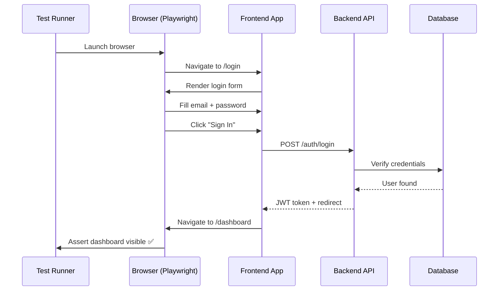

# 05 — End-to-End Testing

> 🟡 **Intermediate**

[← Back to Index](../README.md)

---

E2E tests simulate a **real user interacting with a real browser** against a fully running application. They catch issues that unit and integration tests miss — routing bugs, CSS layout breaks, auth flows, third-party widgets.

## How an E2E Test Works



---

## 5.1 Playwright — Login Flow

**Use case**: Ensuring the login → dashboard flow works for real users.

```typescript
// tests/e2e/auth.spec.ts
import { test, expect } from '@playwright/test';

test.describe('Authentication', () => {
  test.beforeEach(async ({ page }) => {
    // Seed a test user via API before each test
    await page.request.post('/api/test/seed', {
      data: { email: 'test@example.com', password: 'Password123!', name: 'Test User' },
    });
  });

  test('user can log in and sees the dashboard', async ({ page }) => {
    await page.goto('/login');

    await page.getByLabel('Email').fill('test@example.com');
    await page.getByLabel('Password').fill('Password123!');
    await page.getByRole('button', { name: 'Sign In' }).click();

    await expect(page).toHaveURL('/dashboard');
    await expect(page.getByRole('heading', { name: 'Welcome, Test User' })).toBeVisible();
  });

  test('shows error message for invalid credentials', async ({ page }) => {
    await page.goto('/login');
    await page.getByLabel('Email').fill('test@example.com');
    await page.getByLabel('Password').fill('wrongpassword');
    await page.getByRole('button', { name: 'Sign In' }).click();

    await expect(page.getByText('Invalid email or password')).toBeVisible();
    await expect(page).toHaveURL('/login');
  });

  test('redirects to login when accessing protected page unauthenticated', async ({ page }) => {
    await page.goto('/dashboard');
    await expect(page).toHaveURL('/login?redirect=/dashboard');
  });
});
```

---

## 5.2 Playwright — Shopping Cart Checkout

**Use case**: A critical checkout flow on an e-commerce site.

```typescript
// tests/e2e/checkout.spec.ts
import { test, expect } from '@playwright/test';
import { loginAs } from './helpers/auth';

test.describe('Checkout flow', () => {
  test.beforeEach(async ({ page }) => {
    await loginAs(page, 'customer@example.com');
  });

  test('user can add item to cart and complete purchase', async ({ page }) => {
    await page.goto('/products/awesome-widget');
    await expect(page.getByRole('heading', { name: 'Awesome Widget' })).toBeVisible();

    await page.getByRole('button', { name: 'Add to Cart' }).click();
    await expect(page.getByTestId('cart-count')).toHaveText('1');

    await page.getByTestId('cart-icon').click();
    await expect(page).toHaveURL('/cart');
    await expect(page.getByText('Awesome Widget')).toBeVisible();

    await page.getByRole('button', { name: 'Proceed to Checkout' }).click();

    await page.getByLabel('Address').fill('123 Main St');
    await page.getByLabel('City').fill('Springfield');
    await page.getByLabel('ZIP').fill('12345');

    // Use Stripe test card
    await page.getByLabel('Card Number').fill('4242 4242 4242 4242');
    await page.getByLabel('Expiry').fill('12/28');
    await page.getByLabel('CVC').fill('123');

    await page.getByRole('button', { name: 'Place Order' }).click();

    await expect(page.getByRole('heading', { name: 'Order Confirmed!' })).toBeVisible();
    await expect(page.getByTestId('order-id')).toBeVisible();
  });
});
```

---

## E2E Best Practices

| Do | Don't |
|----|-------|
| Test only critical user journeys | Test every edge case (use unit tests for that) |
| Seed data via API, not UI | Click through UI to set up test state |
| Use `data-testid` for selectors | Use CSS classes or XPaths that change |
| Run in CI against a real build | Run against a dev server with hot reload |
| Parallelise across browsers | Run all tests sequentially |

## Playwright Config

```typescript
// playwright.config.ts
import { defineConfig } from '@playwright/test';

export default defineConfig({
  testDir: './tests/e2e',
  fullyParallel: true,
  retries: process.env.CI ? 2 : 0,  // retry flaky tests in CI only
  workers: process.env.CI ? 4 : undefined,
  reporter: [['html'], ['github']],
  use: {
    baseURL: process.env.BASE_URL ?? 'http://localhost:3000',
    trace: 'on-first-retry',
    screenshot: 'only-on-failure',
  },
  projects: [
    { name: 'chromium', use: { ...devices['Desktop Chrome'] } },
    { name: 'mobile', use: { ...devices['iPhone 13'] } },
  ],
});
```

---

**← Previous:** [Integration Testing](./04-integration-testing.md) · **Next →** [API Testing](./06-api-testing.md)
