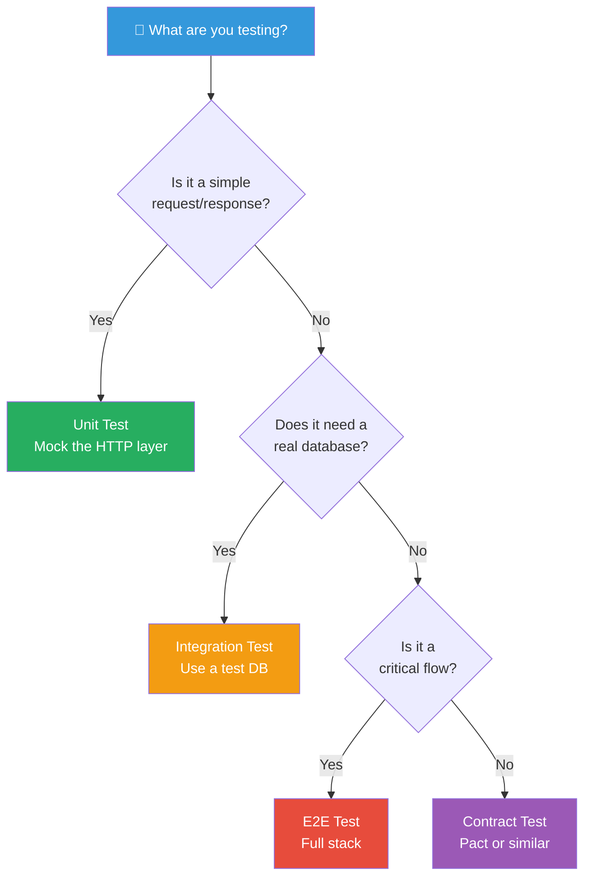

# 06 — API Testing

> 🟡 **Intermediate**

[← Back to Index](../README.md)

---

API testing validates that your HTTP endpoints behave correctly — right status codes, response shapes, error handling, auth, and edge cases.

## Choosing the Right Test Type



---

## 6.1 REST API Test Suite with Supertest

**Use case**: A complete CRUD API for blog posts.

```javascript
// tests/api/posts.test.js
import request from 'supertest';
import { app } from '../../src/app';
import { createToken } from '../helpers/auth';

const authToken = createToken({ userId: 'user-1', role: 'author' });
const adminToken = createToken({ userId: 'admin-1', role: 'admin' });

describe('Posts API', () => {
  describe('GET /api/posts', () => {
    it('returns paginated list of published posts', async () => {
      const res = await request(app).get('/api/posts?page=1&limit=10').expect(200);

      expect(res.body).toMatchObject({
        data: expect.arrayContaining([
          expect.objectContaining({
            id: expect.any(String),
            title: expect.any(String),
            status: 'published',
          }),
        ]),
        meta: {
          page: 1,
          limit: 10,
          total: expect.any(Number),
        },
      });
    });

    it('filters by category', async () => {
      const res = await request(app).get('/api/posts?category=tech').expect(200);
      res.body.data.forEach(post => expect(post.category).toBe('tech'));
    });

    it('returns empty array when no posts match', async () => {
      const res = await request(app).get('/api/posts?category=nonexistent').expect(200);
      expect(res.body.data).toEqual([]);
    });
  });

  describe('POST /api/posts', () => {
    it('creates a post when authenticated', async () => {
      const res = await request(app)
        .post('/api/posts')
        .set('Authorization', `Bearer ${authToken}`)
        .send({ title: 'Hello World', body: 'Content here', category: 'tech' })
        .expect(201);

      expect(res.body).toMatchObject({
        id: expect.any(String),
        title: 'Hello World',
        authorId: 'user-1',
        status: 'draft',
      });
    });

    it('returns 401 without authentication', async () => {
      await request(app)
        .post('/api/posts')
        .send({ title: 'Test', body: 'Content' })
        .expect(401);
    });

    it('returns 422 with validation errors', async () => {
      const res = await request(app)
        .post('/api/posts')
        .set('Authorization', `Bearer ${authToken}`)
        .send({ body: 'Missing title' })
        .expect(422);

      expect(res.body.errors).toContainEqual(
        expect.objectContaining({ field: 'title', message: expect.any(String) })
      );
    });
  });

  describe('DELETE /api/posts/:id', () => {
    it('allows admin to delete any post', async () => {
      await request(app)
        .delete('/api/posts/post-123')
        .set('Authorization', `Bearer ${adminToken}`)
        .expect(204);
    });

    it("forbids author from deleting another author's post", async () => {
      await request(app)
        .delete('/api/posts/post-by-other-author')
        .set('Authorization', `Bearer ${authToken}`)
        .expect(403);
    });
  });
});
```

---

## 6.2 GraphQL API Testing

```javascript
// tests/api/graphql.test.js
import request from 'supertest';
import { app } from '../../src/app';

const gql = (query, variables = {}) =>
  request(app).post('/graphql').send({ query, variables });

describe('GraphQL API', () => {
  describe('Query: user', () => {
    it('returns a user by id', async () => {
      const res = await gql(`
        query GetUser($id: ID!) {
          user(id: $id) { id name email }
        }
      `, { id: 'user-1' }).expect(200);

      expect(res.body.errors).toBeUndefined();
      expect(res.body.data.user).toMatchObject({
        id: 'user-1',
        name: expect.any(String),
        email: expect.any(String),
      });
    });

    it('returns null for nonexistent user', async () => {
      const res = await gql(`
        query { user(id: "nonexistent") { id name } }
      `).expect(200);

      expect(res.body.data.user).toBeNull();
    });
  });

  describe('Mutation: createPost', () => {
    it('creates a post successfully', async () => {
      const res = await gql(`
        mutation CreatePost($input: CreatePostInput!) {
          createPost(input: $input) { id title status }
        }
      `, { input: { title: 'GraphQL Post', body: 'Content', categoryId: 'cat-1' } })
        .set('Authorization', 'Bearer valid-token')
        .expect(200);

      expect(res.body.data.createPost.status).toBe('DRAFT');
    });
  });
});
```

---

## API Testing Checklist

For every endpoint, verify:

- [ ] **Happy path** — correct input returns correct output
- [ ] **Auth** — unauthenticated returns 401, unauthorized returns 403
- [ ] **Validation** — missing/invalid fields return 400/422 with helpful errors
- [ ] **Not found** — missing resource returns 404
- [ ] **Conflict** — duplicate resource returns 409
- [ ] **Pagination** — list endpoints respect `limit` and `offset`/`cursor`
- [ ] **Filtering** — filter params narrow results correctly
- [ ] **Response shape** — body matches the documented schema

---

**← Previous:** [End-to-End Testing](./05-end-to-end-testing.md) · **Next →** [Frontend Testing](./07-frontend-testing.md)
