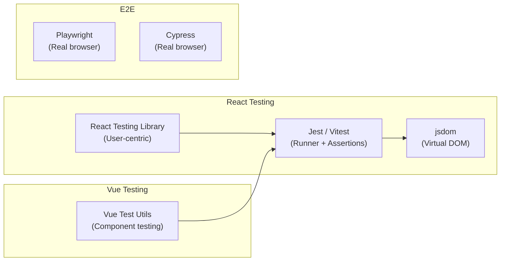

# 07 — Frontend Testing

> 🟡 **Intermediate**

[← Back to Index](../README.md)

---

Frontend testing covers components, user interactions, state management, and rendering behavior.

## The Frontend Testing Stack



> **Golden rule of React Testing Library**: Test what the user sees and does, not implementation details. Avoid testing internal state or refs directly.

---

## 7.1 React Component Testing

**Use case**: Testing a product search component with filtering.

```tsx
// components/ProductSearch.tsx
import { useState } from 'react';

interface Product {
  id: string;
  name: string;
  category: string;
  price: number;
}

interface Props {
  products: Product[];
  onAddToCart: (product: Product) => void;
}

export function ProductSearch({ products, onAddToCart }: Props) {
  const [query, setQuery] = useState('');
  const [category, setCategory] = useState('all');

  const filtered = products.filter(p => {
    const matchesQuery = p.name.toLowerCase().includes(query.toLowerCase());
    const matchesCategory = category === 'all' || p.category === category;
    return matchesQuery && matchesCategory;
  });

  return (
    <div>
      <input
        aria-label="Search products"
        value={query}
        onChange={e => setQuery(e.target.value)}
        placeholder="Search..."
      />
      <select
        aria-label="Filter by category"
        value={category}
        onChange={e => setCategory(e.target.value)}
      >
        <option value="all">All Categories</option>
        <option value="electronics">Electronics</option>
        <option value="clothing">Clothing</option>
      </select>

      {filtered.length === 0 ? (
        <p role="status">No products found</p>
      ) : (
        <ul>
          {filtered.map(product => (
            <li key={product.id}>
              <span>{product.name}</span>
              <span>${product.price}</span>
              <button onClick={() => onAddToCart(product)}>Add to Cart</button>
            </li>
          ))}
        </ul>
      )}
    </div>
  );
}
```

```tsx
// components/ProductSearch.test.tsx
import { render, screen } from '@testing-library/react';
import userEvent from '@testing-library/user-event';
import { describe, it, expect, vi } from 'vitest';
import { ProductSearch } from './ProductSearch';

const mockProducts = [
  { id: '1', name: 'MacBook Pro', category: 'electronics', price: 1999 },
  { id: '2', name: 'iPhone 15', category: 'electronics', price: 999 },
  { id: '3', name: 'Blue T-Shirt', category: 'clothing', price: 29 },
  { id: '4', name: 'Running Shoes', category: 'clothing', price: 89 },
];

describe('ProductSearch', () => {
  it('renders all products initially', () => {
    render(<ProductSearch products={mockProducts} onAddToCart={vi.fn()} />);
    expect(screen.getAllByRole('listitem')).toHaveLength(4);
  });

  it('filters products by search query', async () => {
    const user = userEvent.setup();
    render(<ProductSearch products={mockProducts} onAddToCart={vi.fn()} />);

    await user.type(screen.getByLabelText('Search products'), 'iphone');

    expect(screen.getAllByRole('listitem')).toHaveLength(1);
    expect(screen.getByText('iPhone 15')).toBeInTheDocument();
  });

  it('filters products by category', async () => {
    const user = userEvent.setup();
    render(<ProductSearch products={mockProducts} onAddToCart={vi.fn()} />);

    await user.selectOptions(screen.getByLabelText('Filter by category'), 'clothing');

    expect(screen.getAllByRole('listitem')).toHaveLength(2);
    expect(screen.getByText('Blue T-Shirt')).toBeInTheDocument();
    expect(screen.queryByText('MacBook Pro')).not.toBeInTheDocument();
  });

  it('shows empty state when no products match', async () => {
    const user = userEvent.setup();
    render(<ProductSearch products={mockProducts} onAddToCart={vi.fn()} />);

    await user.type(screen.getByLabelText('Search products'), 'xyz-doesnt-exist');

    expect(screen.getByRole('status')).toHaveTextContent('No products found');
  });

  it('calls onAddToCart with the correct product', async () => {
    const user = userEvent.setup();
    const onAddToCart = vi.fn();
    render(<ProductSearch products={mockProducts} onAddToCart={onAddToCart} />);

    await user.type(screen.getByLabelText('Search products'), 'macbook');
    await user.click(screen.getByRole('button', { name: 'Add to Cart' }));

    expect(onAddToCart).toHaveBeenCalledOnce();
    expect(onAddToCart).toHaveBeenCalledWith(mockProducts[0]);
  });

  it('search is case-insensitive', async () => {
    const user = userEvent.setup();
    render(<ProductSearch products={mockProducts} onAddToCart={vi.fn()} />);

    await user.type(screen.getByLabelText('Search products'), 'MACBOOK');

    expect(screen.getByText('MacBook Pro')).toBeInTheDocument();
  });
});
```

---

## 7.2 Testing Async Components & API Calls

**Use case**: A component that fetches user data on mount.

```tsx
// components/UserProfile.test.tsx
import { render, screen, waitFor } from '@testing-library/react';
import { vi, describe, it, expect, beforeEach } from 'vitest';
import { UserProfile } from './UserProfile';
import * as api from '../api/users';

vi.mock('../api/users');

describe('UserProfile', () => {
  beforeEach(() => {
    vi.clearAllMocks();
  });

  it('shows loading state initially', () => {
    vi.mocked(api.getUser).mockResolvedValue({ id: '1', name: 'Alice' });
    render(<UserProfile userId="1" />);
    expect(screen.getByRole('status', { name: /loading/i })).toBeInTheDocument();
  });

  it('displays user data after fetch', async () => {
    vi.mocked(api.getUser).mockResolvedValue({
      id: '1',
      name: 'Alice',
      email: 'alice@example.com',
    });
    render(<UserProfile userId="1" />);

    await waitFor(() => {
      expect(screen.getByText('Alice')).toBeInTheDocument();
      expect(screen.getByText('alice@example.com')).toBeInTheDocument();
    });
  });

  it('shows error message when fetch fails', async () => {
    vi.mocked(api.getUser).mockRejectedValue(new Error('Network error'));
    render(<UserProfile userId="1" />);

    await waitFor(() => {
      expect(screen.getByRole('alert')).toHaveTextContent(/failed to load user/i);
    });
  });
});
```

---

## Frontend Testing Checklist

- [ ] Component renders without crashing with valid props
- [ ] User interactions (click, type, select) produce expected output
- [ ] Loading, error, and empty states are rendered correctly
- [ ] Conditional rendering shows/hides elements correctly
- [ ] Callbacks (onSubmit, onClose) are called with correct arguments
- [ ] Accessibility: elements have correct roles and labels

---

**← Previous:** [API Testing](./06-api-testing.md) · **Next →** [Performance Testing](./08-performance-testing.md)
