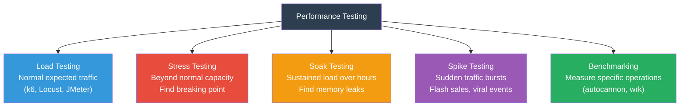

# 08 — Performance Testing

> 🔴 **Advanced**

[← Back to Index](../README.md)

---

Performance tests verify your application handles load, responds quickly, and doesn't degrade under stress.

## Types of Performance Testing



| Type | Goal | Duration | When to Run |
|------|------|----------|-------------|
| Load | Verify normal traffic | 5–30 min | Before every release |
| Stress | Find breaking point | 30–60 min | Before major launches |
| Soak | Detect memory leaks | 4–24 hours | Weekly / pre-launch |
| Spike | Validate auto-scaling | 10–20 min | Before high-traffic events |
| Benchmark | Baseline single endpoint | 1–5 min | On every PR (optional) |

---

## 8.1 Load Testing with k6

**Use case**: Load testing a user authentication endpoint before a product launch.

```javascript
// tests/performance/login.k6.js
import http from 'k6/http';
import { check, sleep } from 'k6';
import { Rate, Trend } from 'k6/metrics';

const errorRate = new Rate('errors');
const loginDuration = new Trend('login_duration', true);

export const options = {
  stages: [
    { duration: '30s', target: 10 },   // ramp up to 10 users
    { duration: '1m', target: 50 },    // ramp to 50 users
    { duration: '2m', target: 50 },    // hold at 50
    { duration: '30s', target: 0 },    // ramp down
  ],
  thresholds: {
    http_req_duration: ['p(95)<500'],   // 95% of requests under 500ms
    errors: ['rate<0.01'],              // error rate below 1%
    login_duration: ['p(99)<1000'],     // 99th percentile under 1s
  },
};

export default function () {
  const payload = JSON.stringify({
    email: `user${Math.floor(Math.random() * 1000)}@example.com`,
    password: 'Password123!',
  });

  const res = http.post('http://api.example.com/auth/login', payload, {
    headers: { 'Content-Type': 'application/json' },
  });

  const success = check(res, {
    'status is 200 or 401': (r) => r.status === 200 || r.status === 401,
    'response time OK': (r) => r.timings.duration < 500,
    'has auth token': (r) => r.status !== 200 || r.json('token') !== undefined,
  });

  errorRate.add(!success);
  loginDuration.add(res.timings.duration);

  sleep(1);
}
```

Run it:

```bash
k6 run tests/performance/login.k6.js

# With output to InfluxDB for Grafana dashboards
k6 run --out influxdb=http://localhost:8086/k6 tests/performance/login.k6.js
```

---

## 8.2 Locust (Python)

```python
# tests/performance/locustfile.py
from locust import HttpUser, task, between

class ApiUser(HttpUser):
    wait_time = between(1, 3)
    token = None

    def on_start(self):
        response = self.client.post("/auth/login", json={
            "email": "loadtest@example.com",
            "password": "Password123!"
        })
        self.token = response.json().get("token")

    @task(3)
    def list_posts(self):
        self.client.get("/api/posts", headers={"Authorization": f"Bearer {self.token}"})

    @task(1)
    def create_post(self):
        self.client.post("/api/posts",
            json={"title": "Load Test Post", "body": "Content", "category": "tech"},
            headers={"Authorization": f"Bearer {self.token}"}
        )
```

```bash
locust -f tests/performance/locustfile.py --headless \
  --users 50 --spawn-rate 5 --run-time 2m \
  --host http://api.example.com
```

---

## 8.3 Performance Budget in CI

Fail the pipeline if p95 exceeds your budget:

```yaml
# .github/workflows/perf.yml excerpt
- name: Run k6 smoke test
  run: k6 run --out json=results.json tests/performance/login.k6.js

- name: Assert performance budget
  run: |
    p95=$(cat results.json | jq '[.metrics.http_req_duration.values."p(95)"] | .[0]')
    echo "p95 response time: ${p95}ms"
    if (( $(echo "$p95 > 500" | bc -l) )); then
      echo "❌ Exceeds 500ms budget"
      exit 1
    fi
    echo "✅ Within budget"
```

---

**← Previous:** [Frontend Testing](./07-frontend-testing.md) · **Next →** [Security Testing](./09-security-testing.md)
