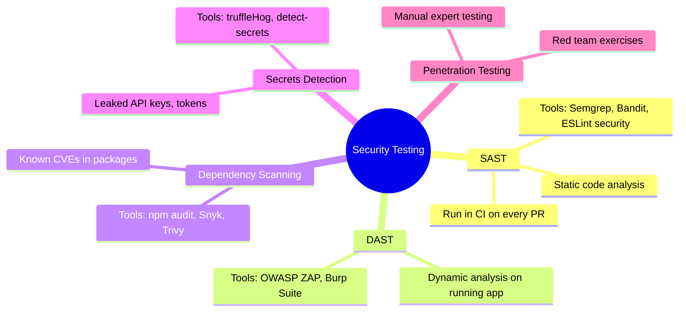

# 09 — Security Testing

> 🔴 **Advanced**

[← Back to Index](../README.md)

---

Security testing finds vulnerabilities before attackers do.

## Security Testing Landscape



| Layer | When | Automated? |
|-------|------|-----------|
| **SAST** | Every PR | ✅ Yes |
| **Dependency scan** | Every PR + daily | ✅ Yes |
| **Secrets detection** | Every commit | ✅ Yes |
| **DAST** | Post-deploy to staging | ✅ Partially |
| **Pen testing** | Quarterly / pre-launch | ❌ Manual |

---

## 9.1 Input Validation Security Tests

**Use case**: Preventing SQL injection and XSS in user inputs.

```javascript
// tests/security/input-validation.test.js
import request from 'supertest';
import { app } from '../../src/app';

describe('Input Validation Security', () => {
  describe('SQL Injection Prevention', () => {
    const sqlPayloads = [
      "'; DROP TABLE users; --",
      "' OR '1'='1",
      "1; SELECT * FROM users",
      "admin'--",
      "' UNION SELECT * FROM users --",
    ];

    sqlPayloads.forEach(payload => {
      it(`handles SQL injection payload: ${payload.substring(0, 20)}...`, async () => {
        const res = await request(app)
          .get(`/api/users?search=${encodeURIComponent(payload)}`);

        // Should never return 500 (which would indicate an unhandled DB error)
        expect(res.status).not.toBe(500);
        if (res.status === 200) {
          expect(res.body.data).toBeInstanceOf(Array);
        }
      });
    });
  });

  describe('XSS Prevention', () => {
    it('sanitizes HTML in user-submitted content', async () => {
      const xssPayload = '<script>alert("xss")</script>';

      const res = await request(app)
        .post('/api/posts')
        .set('Authorization', 'Bearer valid-token')
        .send({ title: 'Normal Title', body: xssPayload });

      if (res.status === 201) {
        expect(res.body.body).not.toContain('<script>');
        expect(res.body.body).not.toContain('alert');
      }
    });
  });

  describe('Rate Limiting', () => {
    it('blocks brute-force login attempts', async () => {
      const requests = Array(101).fill(null).map(() =>
        request(app).post('/auth/login').send({
          email: 'brute@example.com',
          password: 'wrong',
        })
      );

      const responses = await Promise.all(requests);
      const tooManyRequests = responses.filter(r => r.status === 429);
      expect(tooManyRequests.length).toBeGreaterThan(0);
    });
  });

  describe('Security Headers', () => {
    it('returns required security headers', async () => {
      const res = await request(app).get('/');
      expect(res.headers['x-content-type-options']).toBe('nosniff');
      expect(res.headers['x-frame-options']).toBeDefined();
      expect(res.headers['strict-transport-security']).toBeDefined();
    });
  });
});
```

---

## 9.2 Dependency Scanning in CI

```yaml
# GitHub Actions
- name: Audit npm dependencies
  run: npm audit --audit-level=high

- name: Snyk vulnerability scan
  uses: snyk/actions/node@master
  env:
    SNYK_TOKEN: ${{ secrets.SNYK_TOKEN }}
  with:
    args: --severity-threshold=high
```

```bash
# Python equivalent
pip install safety
safety check --full-report
```

---

## 9.3 Secrets Detection (Pre-commit)

```yaml
# .pre-commit-config.yaml
repos:
  - repo: https://github.com/Yelp/detect-secrets
    rev: v1.4.0
    hooks:
      - id: detect-secrets
        args: ['--baseline', '.secrets.baseline']

  - repo: https://github.com/trufflesecurity/trufflehog
    rev: v3.63.0
    hooks:
      - id: trufflehog
```

---

## OWASP Top 10 — Test Coverage Map

| Vulnerability | Test Type | Tool |
|--------------|-----------|------|
| Injection (SQL, NoSQL) | Security integration test | Supertest + payloads |
| Broken Authentication | Integration test | Auth flow tests |
| Sensitive Data Exposure | Security headers test | Supertest |
| XXE | Input validation test | Custom payloads |
| Broken Access Control | Authorization tests | Role-based test matrix |
| Security Misconfiguration | DAST | OWASP ZAP |
| XSS | Security integration test | Sanitization tests |
| Insecure Deserialization | Unit test | Custom payloads |
| Vulnerable Dependencies | Dependency scan | npm audit / Snyk |
| Insufficient Logging | Manual / audit | Log review |

---

**← Previous:** [Performance Testing](./08-performance-testing.md) · **Next →** [Contract Testing](./10-contract-testing.md)
