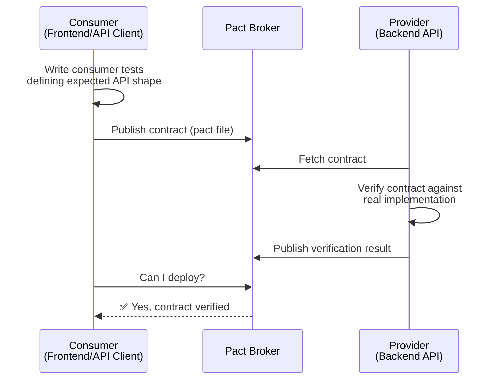

# 10 — Contract Testing

> 🔴 **Advanced**

[← Back to Index](../README.md)

---

Contract testing ensures that **services that communicate with each other maintain compatibility**, without needing to run both services simultaneously.

## The Problem Contract Testing Solves

When a frontend team and backend team deploy independently, breaking API changes can go undetected until production. Contract testing creates a verified agreement between the two sides.



## Contract vs Integration Testing

| | Integration Test | Contract Test |
|---|---|---|
| Both services running? | ✅ Yes | ❌ No |
| Tests real network? | ✅ Yes | ❌ No (mocked) |
| Catches breaking changes? | ✅ Yes | ✅ Yes |
| Fast? | ❌ Slow | ✅ Fast |
| Independent deployment? | ❌ Hard | ✅ Easy |

---

## 10.1 Pact — Consumer Side

The consumer defines exactly what it expects from the provider.

```javascript
// tests/contract/userApi.consumer.test.js
import { Pact } from '@pact-foundation/pact';
import { UserApiClient } from '../../src/clients/userApiClient';

const provider = new Pact({
  consumer: 'FrontendApp',
  provider: 'UserService',
  port: 8080,
});

describe('UserService Contract — Consumer', () => {
  beforeAll(() => provider.setup());
  afterAll(() => provider.finalize());
  afterEach(() => provider.verify());

  it('returns a user when found', async () => {
    await provider.addInteraction({
      state: 'user u-123 exists',
      uponReceiving: 'a request for user u-123',
      withRequest: {
        method: 'GET',
        path: '/users/u-123',
        headers: { Accept: 'application/json' },
      },
      willRespondWith: {
        status: 200,
        headers: { 'Content-Type': 'application/json' },
        body: {
          id: 'u-123',
          name: 'Alice Smith',
          email: 'alice@example.com',
        },
      },
    });

    const client = new UserApiClient('http://localhost:8080');
    const user = await client.getUser('u-123');

    expect(user.id).toBe('u-123');
    expect(user.name).toBe('Alice Smith');
  });

  it('returns 404 when user does not exist', async () => {
    await provider.addInteraction({
      state: 'user u-999 does not exist',
      uponReceiving: 'a request for a missing user',
      withRequest: { method: 'GET', path: '/users/u-999' },
      willRespondWith: { status: 404 },
    });

    const client = new UserApiClient('http://localhost:8080');
    await expect(client.getUser('u-999')).rejects.toThrow('Not found');
  });
});
```

---

## 10.2 Pact — Provider Verification

The provider runs the pact against its real implementation to verify compatibility.

```javascript
// tests/contract/userApi.provider.test.js
import { Verifier } from '@pact-foundation/pact';
import { app } from '../../src/app';
import { db } from '../../src/db';

describe('UserService — Provider Verification', () => {
  it('validates the contract against the UserService', async () => {
    const server = app.listen(3001);

    await new Verifier({
      providerBaseUrl: 'http://localhost:3001',
      pactBrokerUrl: process.env.PACT_BROKER_URL,
      pactBrokerToken: process.env.PACT_BROKER_TOKEN,
      provider: 'UserService',
      publishVerificationResult: true,
      providerVersion: process.env.GIT_SHA,

      // Set up state (database seeding) per interaction
      stateHandlers: {
        'user u-123 exists': async () => {
          await db('users').insert({ id: 'u-123', name: 'Alice Smith', email: 'alice@example.com' });
        },
        'user u-999 does not exist': async () => {
          await db('users').where({ id: 'u-999' }).delete();
        },
      },
    }).verifyProvider();

    server.close();
  });
});
```

---

## When to Use Contract Testing

✅ **Good fit when:**
- Frontend and backend are deployed independently
- Multiple consumers (web, mobile, third-party) depend on one API
- Teams own different services and coordinate on schema changes

❌ **Skip when:**
- Frontend and backend are in a monorepo, deployed together
- The API is internal and tested via integration tests already
- The overhead of a Pact Broker isn't justified for the team size

---

**← Previous:** [Security Testing](./09-security-testing.md) · **Next →** [CI/CD Integration](./11-cicd-integration.md)
