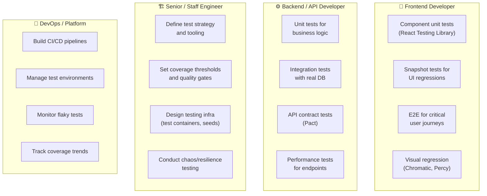
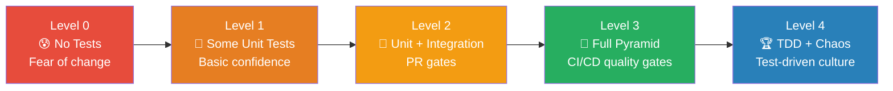

# 12 — Test Strategy by Role

> 🔴 **Advanced**

[← Back to Index](../README.md)

---

Different roles have different testing responsibilities. Here's how a healthy testing culture distributes ownership.

## Responsibilities by Role

---

## Testing Maturity Model

Where is your team today?

| Level | Characteristics | Next Step |
|-------|----------------|-----------|
| 0 | No tests, everything is manual | Write unit tests for one critical module |
| 1 | Some unit tests, no CI gates | Add integration tests, enforce on PR |
| 2 | Unit + integration in CI | Add E2E for critical flows, coverage gates |
| 3 | Full pyramid, quality gates | Introduce TDD practice, chaos testing |
| 4 | TDD culture, chaos engineering | Maintain and iterate |

---

## What to Test by Scenario

| Scenario | Unit | Integration | E2E | Performance | Security |
|----------|------|-------------|-----|-------------|----------|
| New utility function | ✅ Must | ❌ Skip | ❌ Skip | ❌ Skip | ❌ Skip |
| New API endpoint | ✅ Business logic | ✅ HTTP + DB | ⚠️ Critical only | ⚠️ High traffic | ✅ Auth/validation |
| New UI component | ✅ Logic/render | ❌ Skip | ⚠️ Critical flow | ❌ Skip | ❌ Skip |
| Auth flow change | ✅ Token logic | ✅ Full flow | ✅ Must | ✅ Load test | ✅ Security test |
| Database migration | ❌ Skip | ✅ Must | ❌ Skip | ⚠️ If large table | ❌ Skip |
| Payment integration | ✅ Calculation | ✅ With sandbox | ✅ Full checkout | ✅ Must | ✅ Must |
| Bug fix | ✅ Regression test | ⚠️ If DB-related | ❌ Skip | ❌ Skip | ❌ Skip |
| Performance optimisation | ❌ Skip | ❌ Skip | ❌ Skip | ✅ Must | ❌ Skip |

---

## Introducing Testing to a Legacy Codebase

If you're starting from zero on an existing codebase:

1. **Don't try to test everything at once** — pick the highest-risk modules
2. **Write tests for bugs as you fix them** — regression tests prevent recurrence
3. **Start with integration tests** — they give the most coverage with least mocking
4. **Add coverage gates incrementally** — start at 40%, raise 10% each quarter
5. **Make the feedback loop fast** — if tests take 20 min, developers skip them

---

**← Previous:** [CI/CD Integration](./11-cicd-integration.md) · **Next →** [Quick Reference](./13-quick-reference.md)
