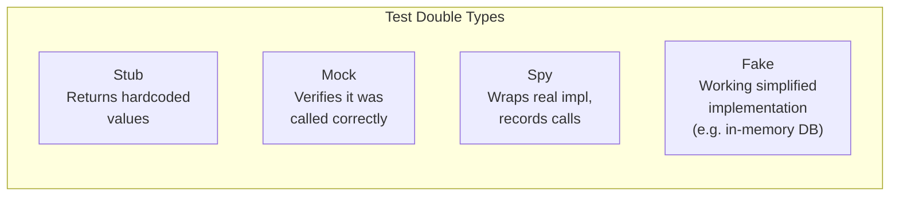
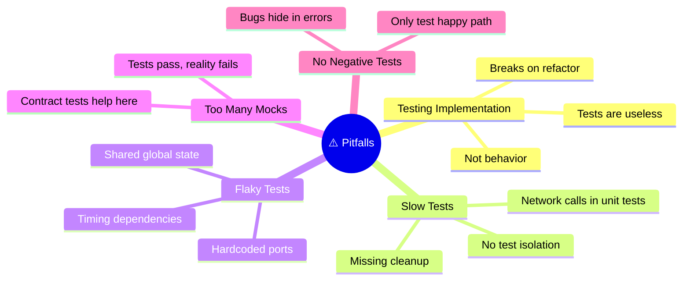

# 13 — Quick Reference Cheatsheet

> All levels

[← Back to Index](../README.md)

---

## Test Naming Conventions

```
it('should [expected behavior] when [condition]')
it('[unit] [action] [expected result]')

✅  it('returns 404 when user does not exist')
✅  it('applyDiscount throws when discount exceeds 100')
✅  it('shows loading spinner while data is fetching')

❌  it('test 1')
❌  it('works correctly')
❌  it('handles edge cases')
```

---

## Mock vs Stub vs Spy vs Fake



| Double | Use When |
|--------|----------|
| **Stub** | You need a dependency to return a specific value |
| **Mock** | You need to verify a function was called (with specific args) |
| **Spy** | You want to observe a real function without replacing it |
| **Fake** | You need a lightweight working version (e.g. in-memory database for tests) |

---

## Common Pitfalls



---

## Assertions Cheatsheet — Vitest / Jest

```javascript
// Value equality
expect(value).toBe(42);                  // strict equality (===)
expect(obj).toEqual({ a: 1 });           // deep equality
expect(obj).toMatchObject({ a: 1 });     // partial match (obj can have more keys)

// Truthiness
expect(value).toBeTruthy();
expect(value).toBeFalsy();
expect(value).toBeNull();
expect(value).toBeDefined();

// Numbers
expect(val).toBeGreaterThan(10);
expect(val).toBeCloseTo(3.14, 2);        // float comparison with precision

// Strings
expect(str).toContain('substring');
expect(str).toMatch(/regex/);

// Arrays
expect(arr).toHaveLength(3);
expect(arr).toContain('item');
expect(arr).toEqual(expect.arrayContaining(['a', 'b']));

// Async
await expect(promise).resolves.toBe('value');
await expect(promise).rejects.toThrow('error message');

// Functions & Mocks
expect(mockFn).toHaveBeenCalled();
expect(mockFn).toHaveBeenCalledTimes(2);
expect(mockFn).toHaveBeenCalledWith('arg1', 'arg2');
expect(mockFn).toHaveBeenLastCalledWith('last-arg');
```

---

## Assertions Cheatsheet — Pytest

```python
# Equality
assert result == expected
assert result != unexpected

# Collections
assert item in collection
assert len(collection) == 3

# Exceptions
with pytest.raises(ValueError, match="invalid"):
    function_that_raises()

# Approx floats
assert result == pytest.approx(3.14, rel=1e-3)

# Mocks (pytest-mock)
mock_fn.assert_called_once()
mock_fn.assert_called_with('arg1', 'arg2')
mock_fn.assert_not_called()
```

---

## Tool Recommendations by Language

| Language | Unit | Integration | E2E | Performance | Security |
|----------|------|-------------|-----|-------------|----------|
| **JavaScript/TS** | Vitest / Jest | Supertest + Vitest | Playwright / Cypress | k6 | npm audit, Semgrep |
| **Python** | pytest | pytest + httpx | Playwright | Locust | bandit, safety |
| **Go** | `testing` pkg | `net/http/httptest` | Playwright | k6 | gosec |
| **Java** | JUnit 5 + Mockito | Spring Boot Test | Selenium / Playwright | Gatling | SpotBugs |
| **Ruby** | RSpec | RSpec + FactoryBot | Capybara | Gatling | Brakeman |

---

## Setup Commands

### JavaScript / TypeScript

```bash
npm install -D vitest @vitest/coverage-v8
npm install -D @testing-library/react @testing-library/user-event @testing-library/jest-dom
npm install -D @playwright/test && npx playwright install
npm install -D supertest @types/supertest
```

### Python

```bash
pip install pytest pytest-asyncio pytest-cov pytest-mock httpx
pytest --cov=. --cov-report=term-missing --cov-fail-under=80
```

---

**← Previous:** [Test Strategy by Role](./12-test-strategy-by-role.md) · [Back to Index](../README.md)
